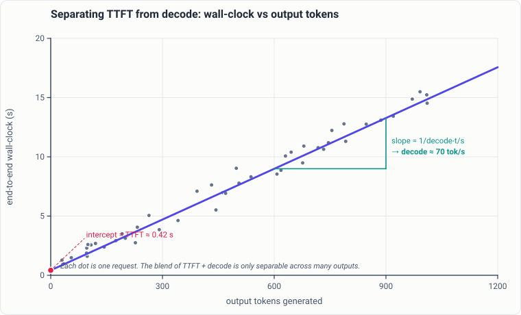

# Measuring it right

Most tuning guides tell you *what* to change. Almost none tell you how to
measure the change so the number means something. On Apple Silicon that gap is
where most reported speedups quietly come from — a hot machine, a blended
metric, a background daemon, or an A/B whose two arms were secretly identical.

This chapter is the discipline the rest of the handbook depends on. If you take
one thing from it: **a benchmark result is a claim about your machine at that
instant, not a property of your code.** Everything below exists to make that
claim reproducible.

See also [the hardware model](hardware.md) for why prefill and decode behave so
differently, and [environment & build](environment.md) for pinning the
interpreter and kernels you are actually measuring.

---

## Decode t/s and TTFT are two different numbers

The single most common mistake is quoting one throughput figure for a request.
A generation has two regimes with different bottlenecks:

- **Prefill / time-to-first-token (TTFT)** is compute-bound. On the M5 it uses
  the GPU's Neural Accelerators, and Apple's own base-M5-vs-M4 figures put the
  prefill/TTFT speedup at **3.33×–4.06×**.
- **Steady-state decode** is memory-bandwidth-bound. Apple's decode speedup over
  the same generation is only **1.19×–1.27×**, because "subsequent tokens are
  bounded by memory bandwidth."

Because these two regimes differ by 3–4× in their hardware behavior, a
wall-clock throughput —

```
tokens_per_second = output_tokens / total_wall_time
```

— is a **blend of the two**, weighted by how many tokens you generated. On a
short output the fixed TTFT cost dominates, so this blended figure *understates*
true steady-state decode speed. On a long output it approaches the decode rate.
The same server will look faster or slower purely from the output length you
happened to request. That is not a property worth reporting.

### The fix: regress duration on output tokens

Instead of dividing once, run *many* calls at varying output lengths and fit a
line. For a fixed prompt, wall time is approximately:

```
duration ≈ TTFT + (1 / decode_tps) * output_tokens
```

so a linear regression of `duration` against `output_tokens` recovers **both**
numbers at once: the **intercept is TTFT**, and the **inverse of the slope is
steady-state decode t/s**. This is the lab's own method and it is the technique
this handbook recommends over any single blended figure.



*The method as a picture (illustrative points). Each dot is one request; a
single request cannot separate the fixed and per-token costs, but the fit across
many does: the **intercept is TTFT** and the **inverse slope is steady-state
decode t/s**. A blended "tokens ÷ total time" number is just one dot's slope
from the origin — and on short outputs it badly understates decode speed.*

```python
# Illustrative only. Recover TTFT and steady-state decode t/s from many calls.
# Each call generates a different number of output tokens against a FIXED prompt.
import numpy as np
import time

samples = []  # collect (output_tokens, wall_seconds) across many calls
for max_tokens in [16, 32, 64, 128, 256, 512]:
    for _ in range(5):                      # repeat for variance
        t0 = time.perf_counter()
        n_out = run_generation(prompt, max_tokens=max_tokens)  # returns tokens emitted
        samples.append((n_out, time.perf_counter() - t0))

toks = np.array([n for n, _ in samples], dtype=float)
secs = np.array([s for _, s in samples], dtype=float)

# secs = intercept + slope * toks
slope, intercept = np.polyfit(toks, secs, 1)
decode_tps = 1.0 / slope     # steady-state decode throughput
ttft_s     = intercept       # time to first token

print(f"decode: {decode_tps:6.1f} tok/s   TTFT: {ttft_s*1000:6.1f} ms")
```

A few practical notes:

- Keep the **prompt fixed** across the sweep so TTFT is a constant the intercept
  can absorb; if the prompt length varies, TTFT varies and the intercept is
  meaningless.
- Report the fit quality (residuals / R²). A poor fit means something else is
  moving — thermal drift, contention, a cache effect — and the two recovered
    numbers should not be trusted until you find it.
- The numbers here are illustrative. Do not attribute specific provider figures
  to this method; use it to measure *your* build on *your* machine.

### Also report time per output token

Throughput and latency are reciprocals only after units and scope agree:

```
time_per_output_token_seconds = decode_seconds / decoded_tokens
decode_tokens_per_second      = 1 / time_per_output_token_seconds
```

Exclude the first emitted token from the decode numerator if TTFT already owns
that interval, and state whether end-of-sequence or stop-sequence tokens are
counted. For a streaming API, retain every token timestamp so you can inspect
the distribution of inter-token gaps rather than only the mean. A scheduler can
preserve average tokens/s while introducing visible pauses.

Use a two-dimensional workload grid to keep phase effects visible:

| prompt length | output length | primary question |
|---|---|---|
| short | short | fixed overhead and launch floor |
| long | short | prefill / TTFT and cache reuse |
| short | long | steady decode and thermal drift |
| long | long | KV growth, bandwidth, and stability |

Do not compare systems on one cell and generalize to the other three.

> **Prior art.** The standard serving-benchmark distinction between prefill/TTFT and per-token decode latency.
> **How we differ.** We regress duration on output tokens across many real calls to recover both from noisy end-to-end logs.
> **Our finding.** *Extends prior art* — a practical estimator for when you only have wall-clock plus token counts.

---

## Thermal settling: measure recovery, never sleep a clock

Between benchmark phases the machine needs to return to a repeatable state. The
tempting approach — `sleep(N)` between phases — is wrong in both directions at
once. A fixed cooldown is **simultaneously too long on a cold machine** (dead
wall-time you burn every run) **and too short on a hot one** (the next phase
starts while still throttled, and a drift gate trips *after* you already slept
the full fixed cooldown).

The lab replaced a fixed 420 s inter-phase sleep with a functional settle
protocol, on a simple principle: **what you actually care about is not "is the
machine cool" but "does it still deliver the throughput it delivered at the
start of the window."** That is directly measurable in the same units the
bench reports, needs no privileges, and folds throttling, residual heat, and
ambient contention into one number. Anything that does not show up in that
number is, by definition, not affecting the bench.

### The probe

Use a **fixed-shape, model-free** workload as the calibration — the lab uses a
batched **bf16** GEMM (a `(8, 4096, 4096) @ (4096, 4096)` batched matmul, run as
a single dispatch), with one warmup block discarded for lazy allocation and
kernel specialization. The shape never adapts to the machine; only the block
*count* adapts, to hold each sample near a target duration. Throughput is a
rate, so the block count does not bias it.

**bf16 specifically**, because that is the GEMM path prefill leans on for the
Neural Accelerators — a dtype the machine does not stress tells you nothing
about how hot the bench will run.

### The two-sided band

- Take a **window-start baseline once**, before phase 1, as the **median of 3**
  calibrations — a single noisy sample would mis-set the reference the entire
  window is judged against.
- Sample periodically. A sample **qualifies** when it lands within a two-sided
  band of baseline, e.g. `|tflops/baseline − 1| ≤ 3%`.
- The band is **two-sided on purpose**: a sample well *above* baseline is a
  **confound, not good news** — it means the baseline itself was taken under
  conditions you cannot reproduce.
- Require **N consecutive qualifying samples in a row** (the lab uses 3). Any
  rebound resets the streak.
- Keep a **hard floor** (always wait a minimum, e.g. 60 s, with the streak still
  holding when it clears) and a **ceiling** (e.g. the old fixed cooldown as an
  upper bound).
- If the **ceiling fires**, do **not** abort — proceed and record a
  **fail-closed** result: `settled=False`, which bound fired, and every
  `(t, tflops, ratio)` sample. A downstream gate can then reject or caveat the
  phase *on evidence*, which is strictly more than a fixed sleep ever gave you.

```python
# Illustrative two-sided thermal-settle band.
# probe() runs the fixed bf16 GEMM and returns achieved TFLOP/s.
import statistics, time

def settle(baseline, band=0.03, need=3, floor_s=60, ceil_s=420, poll_s=30):
    start, streak = time.time(), 0
    while True:
        r = probe() / baseline
        # two-sided: a sample ABOVE baseline is a confound, not success
        qualifies = abs(r - 1.0) <= band
        streak = streak + 1 if qualifies else 0
        elapsed = time.time() - start
        if streak >= need and elapsed >= floor_s:
            return {"settled": True, "elapsed_s": elapsed}
        if elapsed >= ceil_s:                       # fail closed, do not abort
            return {"settled": False, "bound": "ceiling", "elapsed_s": elapsed}
        time.sleep(poll_s)

baseline = statistics.median(probe() for _ in range(3))   # median of 3, taken ONCE
```

> **Prior art.** Common practice is a fixed sleep/cooldown between benchmark phases.
> **How we differ.** We wait on a two-sided throughput band against a window-start baseline rather than a fixed clock.
> **Our finding.** *Diverges from prior art* — a fixed clock is both too long (cold) and too short (hot); settle on the quantity you actually care about.

### There is no shortcut through the OS

You cannot gate on a temperature reading, because there is nothing dependable to
gate on:

- **No thermal sysctl exists on Apple Silicon.** Grepping `sysctl -a` for
  `thermal` or `temperat` returns nothing at all.
- **`powermetrics`** is the real instrument (die temp, fan RPM, throttle state)
  but **needs root**, so it cannot run unattended inside a bench window.
- **`pmset -g therm`** is unprivileged but only populates *after* the system has
  recorded a thermal/performance warning — useful as a tripwire, not a gauge.
- **IOKit HID sensors** *do* read die temperatures with no sudo, via pure ctypes
  (`IOHIDEventSystemClientCreate`, matching `PrimaryUsagePage 0xFF00` /
  `PrimaryUsage 5`, then `kIOHIDEventTypeTemperature`) — the route utilities like
  Stats and TG Pro use. But it is a **private API, uncalibrated**, and some
  services return a sentinel value that must be filtered.

!!! warning "Record telemetry, never gate on it"
    Die temperatures read through IOKit HID are fine to **record** alongside a
    run as garnish. **Never gate a benchmark on them** — they are uncalibrated,
    undocumented, and not stable across macOS releases. The functional
    throughput baseline is the thing you gate on; temperature is only a proxy,
    and a clock is not even that.

> **Prior art.** Tools like `powermetrics` and third-party sensor readers (Stats, TG Pro) via IOKit HID.
> **How we differ.** We read die temps directly via `IOHIDEventSystemClient` with no sudo, then filter sentinel values.
> **Our finding.** *Consistent with prior art* — usable telemetry, but treat as uncalibrated and never a gate.

---

## Machine contention: quote model numbers only from a quiet machine

A model-level run can look **3–4× degraded for reasons that have nothing to do
with your change.** The lab hit exactly this: same-day model-level sanity runs
looked 3–4× slower — but *identically* on a known-good build. That identical
degradation on the control is the proof: it was **ambient machine contention**
(a background daemon, `PerfPowerServices`, spinning ~194% CPU), not the code
under test.

Two lessons follow:

1. **Kernel microbenches are contention-resistant; model-level numbers are
   not.** When a model run looks off, reproduce it on a known-good build. If
   both degrade together, suspect the machine, not the change. A pure-GEMM or
   pure-kernel microbench is the evidence that survives a noisy host.
2. **Quote model-level throughput only from a quiet machine.** Before a
   model-level bench, check that no background daemon is eating CPU, no build
   agent is mutating the tree you are measuring, and nothing else is on the GPU.

This is the same reason decode-throughput benches must be run **serially on an
uncontended GPU** — batching them or running them alongside other GPU work
produces false throughput numbers. (Everything *else* — correctness suites,
many-prompt evals — should be batched; see the A/B discipline below.)

!!! note "Pin the tree you measure"
    Running a GPU experiment against a working tree that other processes are
    concurrently editing means the experiment can fail for reasons unrelated to
    the experiment — e.g. a transiently non-importable module killing the driver
    before steady state. Pin experiments to a detached checkout at a known-good
    commit, or gate each phase on an import smoke check, so a failure is
    attributed correctly instead of being read as an instrument problem.

### Write a run manifest before the first token

A result without its environment is not reproducible. Emit a small JSON record
before loading the model, then append measured outputs rather than overwriting
it:

```python
import json
import platform
import subprocess
import sys
import time
import mlx.core as mx

manifest = {
    "started_unix_s": time.time(),
    "python": sys.version,
    "python_executable": sys.executable,
    "macos": platform.mac_ver()[0],
    "mlx": mx.__version__,
    "model_revision": MODEL_REVISION,
    "quantization": QUANTIZATION_CONFIG,
    "prompt_set_digest": PROMPT_SET_DIGEST,
    "generation": GENERATION_CONFIG,
    "source_revision": subprocess.check_output(
        ["git", "rev-parse", "HEAD"], text=True
    ).strip(),
}
print(json.dumps(manifest, sort_keys=True))
```

Include cache mode, batch/concurrency, exact sampler settings, and whether each
mechanism under test reported that it ran. Avoid recording prompt contents when
they may be sensitive; a stable digest plus a separately governed corpus is
enough to reproduce membership.

> **Prior art.** General benchmarking hygiene ("quiet the machine").
> **How we differ.** We confirm it by reproducing on a known-good control — identical degradation on both arms fingers the host, not the change.
> **Our finding.** *Consistent with prior art* — sharpened: model-level runs looked 3-4x degraded from ambient contention, and microbenches are contention-resistant, so quote model-level numbers only from a quiet machine.

---

## GPU-trace capture on macOS: short windows, count the rows

Instruments / `xctrace` can capture a GPU trace of a decode step, but the
default instinct — record for a while to be safe — is exactly backwards.

### Recording windows are 1–3 s, hard-capped at 5

The shader profiler **samples every shader invocation**, so trace size and
finalization cost scale super-linearly with the window. Measured on a trivial
matmul loop:

| recording window | bundle size | outcome |
|---|---|---|
| 12 s | 1.6 GB | wedged in "Stopping recording…", killed by hand |
| 2 s | 50 MB | finalized cleanly, `rc=0` |

That is a 33× size ratio for a 6× window. Long windows do not finish
finalizing — they *are* the hang that gets misread as a broken instrument. At a
typical decode-step cadence, a 2 s window is already dozens of steps, far more
than any median needs. Cap the flag; do not rely on discipline.

A corollary: because the first many seconds of a model process are load and
prefill, you cannot point a short window at a launch of the driver — you would
record *loading*. Start the driver outside `xctrace`, wait for a ready-file it
writes when steady decode begins, then attach.

### Validate a nonzero row count before declaring success

An empty, schema-only table is **indistinguishable from a good one** unless you
count rows — and the trace's table of contents lists a table even when its
instrument was disabled. So **only the row count proves anything.**

- The dependable table is **`metal-gpu-intervals`** (encoder-level). A 2 s trace
  yields thousands of encoder rows. This table answers **"bubbles vs busy"**:
  per decode step, the span, the union of encoder-busy time, and the
  inter-encoder gap total and share. It does **not** tell you which kernel
  family owns the time — encoder-level and kernel-level are different questions
  that look alike in a table, so name the granularity in your output.
- The per-shader **timing** tables (`metal-shader-profiler-intervals` and
  friends) can export **zero rows** — the instrument enumerates the shaders but
  never samples them. The leading hypothesis is code-signing entitlements (an
  adhoc/linker-signed interpreter with no `get-task-allow`). Treat any shader
  timing table as a **bonus**: zero there is expected and must never fail a run.

### Run xctrace under an external watchdog

No `xctrace` invocation may block indefinitely. Run every call under an
**external** watchdog that escalates **SIGINT → SIGTERM → SIGKILL** on the
process **group** (SIGINT first because it is xctrace's documented early-stop
signal; the group matters because a launched target is a child that a wedged
xctrace will not reap). On expiry, report the trace **FAILED** rather than
waiting on it.

!!! tip "The payoff of doing it right"
    Done this way, an encoder-level capture is decision-grade. One such run
    showed a decode step that was **97.6% GPU-busy with only 2.4% inter-encoder
    gap** — which retires every "issue fewer, larger encoders" lever
    (launch-coalescing and friends) at a 2.4% ceiling *before* any kernel work,
    and redirects effort inside the kernels. That conclusion is only trustworthy
    because the row count was asserted and the window was short.

> **Prior art.** Apple Instruments / `xctrace` and the Metal GPU/shader profilers.
> **How we differ.** We derived operational rules for making captures actually yield data on Apple silicon.
> **Our finding.** *Extends prior art* — 1-3 s windows (long windows hang / make multi-GB traces), validate a nonzero row count, encoder-interval tables work where per-shader tables can export zero rows (code-signing entitlements).

---

## A/B discipline

A benchmark that compares two configurations is only as good as the guarantees
around it. Five rules, each earned from a run that looked clean and meant
nothing.

**1. Assert the mechanism actually ran.** An A/B whose two arms are secretly
identical looks *exactly* like a real null result: arms agree, spread is
plausible, no error anywhere. The lab burned four hours of single-tenant GPU on
a "clean null" across three arms that were all silently running the same code
path, because a config flag routed around the mechanism under test. Corrected,
the same comparison separated by +5% to +16%.

> Instrument the mechanism itself — count calls into the code path under test —
> and make the harness **refuse to record an arm where that count is zero**, or
> where the arm ran a different mode than requested. Verify the guard fails
> closed by running it once against a deliberately broken config, *before* the
> first real run.

**2. Ship the configured path, not an isolated toy.** Isolating a variable is
correct *for a measurement* — but never ship a configuration you only exercised
with its features disabled. A production deploy once broke every multi-turn
conversation because every pre-ship check ran with prefix-reuse and resumable
prefill turned off (deliberately, to keep an output-identity test clean) — which
disabled exactly the path that broke. Before shipping, run at least one check
with the **production config exactly as configured**, on a workload shaped like
real traffic.

**3. Decide the exactness class up front, and state it.** Before you compare
outputs, decide which kind of "same" you require, and gate on *that*:

- **bit-identical** — byte-for-byte identical logits/digests;
- **token-identical** — greedy token stream matches, even if logits differ
  slightly;
- **near-tie numeric** — outputs may diverge only where the model was itself at
  a near-tie, under a stated per-step bound and a reference (e.g. provably no
  further from an fp32/fp64 reference than the stock path).

Digest drift *alone* is not a verdict — a fused reduction can never reproduce a
different summation order bit-for-bit, yet still be provably as accurate. The
verdict is the **class plus its gate**, chosen before the run, not the raw
drift. For a whole-path change, a per-op distance argument is not enough:
validate fidelity on a large corpus with a document-level bootstrap CI, because
a sub-percent perplexity effect only becomes visible past ~100K–200K tokens.

**4. Batch the tests — but discard a warmup.** Run correctness suites and
many-prompt evals with **one model load per pack** rather than reloading per
item; load each configuration once and run everything that needs it before
moving on. The **exceptions are timing-sensitive**: decode-throughput benches
need an **uncontended GPU** (see contention, above) and a **discarded warmup**
generation, or the first-call ramp poisons the number.

**5. A baseline that tracks zero targets is a FAILURE, not a pass.** An overlay
or comparison harness that reports "0 tracked targets" and proceeds green will
validate nothing forever. After regenerating any baseline, **assert the tracked
count is nonzero** and matches what you expect. A fail-closed guard that
silently tracks nothing is worse than no guard.

**6. Toggle the arms inside one process, not one process per arm.** This is
the rule that costs the most to learn late. A per-boot A/B — launch the server
with the feature off, measure, kill it, launch with the feature on, measure —
compares two *machine states* as much as two configurations: different thermal
history, a different page cache, a different allocator arrangement. On a
128 GB machine with a ~100 GB resident model, the second boot is not the same
machine as the first.

> Measured cost of getting this wrong: a scheduling change was screened with one
> boot per arm and recorded as **−24% at 16K and −48% at 64K** on plain decode,
> and was shelved on that basis. Re-measured with both arms as runtime toggles
> inside a single model load, median of three thermally-settled repetitions, the
> same code in the same cells measured **+21% and +24%**. The harness inverted
> the sign of a 24-point effect.

Make every lever a runtime setter rather than an import-time or launch-time
flag. It costs one function and one counter per lever, it lets a single model
load cover every arm, and it removes the confound entirely. When a lever
genuinely cannot be toggled at runtime, interleave boots (`off, on, on, off`)
and report the spread between same-arm boots as a noise floor before quoting any
difference.

**A corollary about rotation.** Interleaving by rotating a list of arms shifts
the whole list, so it never flips the *relative* order of two arms that sit next
to each other. If exactly two arms matter, run them as a two-arm list over two
repetitions, which puts each one first exactly once.

### A small paired harness

Interleave arms so slow machine drift does not line up with one configuration.
Randomize the order within each block, discard a warmup for each newly loaded
arm, and retain raw observations:

```python
import random
import statistics

rng = random.Random(EXPERIMENT_SEED)
rows = []

for block in range(NUM_BLOCKS):
    arms = ["control", "candidate"]
    rng.shuffle(arms)
    for arm in arms:
        result = run_arm(arm, workload=FIXED_WORKLOAD)
        if result["mechanism_calls"] == 0 and arm == "candidate":
            raise RuntimeError("candidate mechanism did not run")
        rows.append({"block": block, "arm": arm, **result})

by_block = {}
for row in rows:
    by_block.setdefault(row["block"], {})[row["arm"]] = row["tpot_ms"]

paired_ratios = [
    values["control"] / values["candidate"]
    for values in by_block.values()
]
print("median_speedup=", statistics.median(paired_ratios))
```

The ratio above is control TPOT divided by candidate TPOT, so values above one
favor the candidate. Report the paired observations or an interval, not only
the median. If the mechanism counter, output gate, or settle gate fails, retain
the row as diagnostic evidence but exclude it from the performance verdict
under a rule written before the run.

### Decide before looking

Write down the primary metric, minimum worthwhile effect, exactness class,
sample count or stopping rule, and invalid-run conditions before collecting the
candidate results. This avoids moving the gate after seeing a noisy win. Use a
held-out prompt pack for the final decision when the change was tuned on a
calibration pack.

> **Prior art.** General experimental rigor / ablation methodology.
> **How we differ.** We codified Apple-silicon failure modes into fail-closed harness guards.
> **Our finding.** *Extends prior art* — catching an A/B whose arms are secretly identical, and validating on real Metal because CPU can't reproduce GPU correctness bugs.

---

## Compress a production day for resilience testing

A performance A/B and a resilience soak answer different questions. Keep
thermal settling for causal speed comparisons. For an operational soak, let
the machine experience the traffic naturally and record temperature alongside
every event. Temperature, memory pressure, and contention are explanatory
signals in this test; they must not pause or reorder the workload.

A useful one-hour soak can represent a full 24-hour production day with a
fixed virtual clock. Preserve the features that create scheduler bugs:

- two or more long-lived users with independent, growing multi-turn histories;
- serialized turns within each user, concurrent work across users;
- short subagent and ambient jobs that arrive independently;
- quiet periods, normal periods, and narrow coincident bursts;
- prose, code, structured output, tool calls and results, summarization, and
  follow-up questions that depend on facts planted earlier in the session;
- fixed adversarial windows for cancellation, abrupt disconnect, overload,
  cache eviction/reallocation, and lane abort; and
- a bounded, reversible host-memory-pressure window that forces live branch
  budgets to be recomputed; and
- a seeded schedule that logs both planned and actual arrival time.

Make the run queryable while it is active. At minimum expose current virtual
time, completed and active requests, queue depth, errors and rejections,
TTFT/ITL p50/p95/p99, tenant fairness, current fault window, and the next event.
Write state atomically and append raw events so a killed monitor cannot corrupt
the evidence.

Use unique response canaries to detect cross-session contamination. Plant a
different fact in each primary history and ask for it late in the day. Record
terminal in-flight work, cache ownership and branch closure, RSS and descriptor
deltas, and mechanism counters for every feature expected to participate. A
configured APC, MTP, segmentation, or heterogeneous lane with a zero counter is
a failed qualification, even if outputs look plausible.

Apply the same rule to fault coverage. A cancellation or disconnect that never
cuts a live stream, an injected cache fault with no server receipt, or an
overload burst that produces no bounded rejection has not tested the named
failure mode. Synthetic dry runs should label these gates unqualified rather
than manufacture passing counters.

On Apple Silicon, unprivileged IOHID PMU die readings can provide a useful
temperature trace. Preserve the full sensor map and label it uncalibrated;
record `pmset -g therm` and memory/swap pressure beside it. Do not turn an
observational production soak into a hidden thermal gate.

> **Prior art.** Production load tests commonly combine diurnal traffic models,
> fault injection, and latency SLOs.
> **How we differ.** We retain multi-turn cache and speculative state, prove
> per-mechanism engagement, and record Apple-silicon thermal and unified-memory
> context without controlling the workload.
> **Our finding.** *Extends prior art* — a short resilience test is credible
> only when its compressed schedule preserves session ordering, burst
> collisions, lifecycle faults, and the exact optimized paths being qualified.

---

## The real-Metal caveat

A final constraint specific to this platform: **MLX correctness bugs frequently
surface only on real Metal hardware.** A no-Metal / CPU sandbox — and even
repeated careful static review — catches structure, not behavior. In one gate,
five genuine bugs all passed compile-checks, collect-only, and multiple reviews
and appeared **only on the GPU**. The definitive correctness gate needs the real
bf16 production model on the Metal driver, not a tiny fp32 synthetic.

The implication for measurement: a green result from a machine without a Metal
GPU means "ready to test," never "done." GPU correctness must be verified **on
device**.

!!! note "Transfer to llama.cpp and vLLM-on-Metal"
    TTFT, time per output token, paired A/Bs, quiet-machine controls, and
    context/output grids do not depend on MLX. Replace the mechanism counters
    with backend-specific evidence: Metal-offloaded layer counts for
    `llama.cpp`, or scheduler, batch, cache-block, and kernel-path counters for a
    vLLM-style server. Keep queue time separate from model time when comparing a
    single-user runtime with a continuously batched service.

---

## Sources

Public tools and APIs referenced in this chapter:

- Apple **Instruments** / **`xctrace`** — command-line trace capture and the
  Metal System Trace / GPU instruments (Apple Developer documentation).
- **IOKit HID** event system — `IOHIDEventSystemClientCreate` and
  `kIOHIDEventTypeTemperature` (Apple IOKit; private/undocumented usage pages,
  read-only, uncalibrated).
- macOS command-line utilities: **`powermetrics`**, **`pmset`**, **`sysctl`**
  (standard macOS; `powermetrics` requires root).
- Apple ML Research, *Exploring LLMs with MLX and the Neural Accelerators in the
  M5 GPU* — for the prefill-vs-decode speedup figures cited above.
- MLX documentation — evaluation semantics, compilation, and Metal tooling:
  <https://ml-explore.github.io/mlx/build/html/index.html>
- MLX-LM — reference generation and serving code used to define comparable
  prompt and decode phases: <https://github.com/ml-explore/mlx-lm>


## A publication packet must qualify the actual mechanism

Keep three evidence lanes separate: raw numerical/cache-state diagnostics,
uninstrumented performance, and human-reviewed behavior. Same-operand shadow
kernels or cache hashing add work and cannot provide clean timing evidence.
A context ladder needs a warmup long enough to reach the measured generation
paths, native extension and Metal-library hashes in addition to git commits,
interleaved controls, and explicit functional-recovery/drift decisions.

Add real multi-turn histories, including the actual assistant outputs, and
record cache-hit and speculative-path engagement per turn. A cold standalone
prompt does not exercise resume, parking or cached-prefix ownership. If a
feature needs a special lifecycle, retain that diagnostic separately rather
than pretending a generic chat turn reached it.

For a small 10×10 knowledge check, freeze the corpus before the run, retain
raw responses and finish reasons for both arms, and review meaning rather
than treating substring hits as correctness. Fix ambiguous questions before
freezing (for example, conserved energy requires an isolated system, not
merely a closed system). Distinguish model errors from infrastructure errors,
truncation, and absent mechanism engagement. A 100-question local regression
check is not a standardized capability benchmark.

Keep a timing ladder's decode workload fixed across every arm. If an
incidental EOS can shorten one request, record the run as incomplete or use an
explicit benchmark-only fixed-length mode that suppresses stop handling for
those cells. Restore normal EOS behavior for multi-turn and answer-quality
suites; their natural stop behavior is part of the evidence. Record this mode
in each receipt so fixed-work timing cannot be mistaken for semantic serving.

### Qualify the thermal probe itself

Use the same probe duration and polling interval for the loaded baseline and
every later settle check. A reference obtained without the model loaded is
a diagnostic of the probe, not a reference to transplant into a model run.
Retain calibration failures even when they precede the first measured arm.

In the September 12 Qwen4 publication run, one-second GEMM probes polled every
ten seconds varied between roughly 22 and 62 TFLOP/s and failed the declared
three-consecutive-sample, 3% stability rule. No measured ladder rows were
produced. A separate model-free diagnostic with 2.5-second probes and
15-second polling stabilized after 108 seconds. The next loaded run was
configured prospectively with that same longer regime for calibration and
settling, preserving the original stability and control-drift limits.

That observation does not prove the source of the bimodality. Record setup
work outside the timed loop too: fresh input allocations, allocator resets,
warmup work and idle intervals can change the operating state. Investigate
those independently before attributing a throughput mode to a different
hardware execution path. Longer sampling is a candidate probe correction,
not permission to discard unfavorable measured arms or loosen the gate.

Apply the deadline before launching another probe and before accepting its
result. A clock-injection regression found a final probe starting at a
120-second ceiling and incorrectly qualifying at 122.5 seconds. The shared
helper now retains an overrun as diagnostic evidence while refusing to
qualify it; it does not attempt to interrupt an in-flight GPU operation.
The repair passed 49 host tests, including exact-deadline completion and
unchanged band arithmetic.

The loaded follow-up did eventually satisfy the same rule at 130.162 seconds,
just beyond the original 120-second ceiling. That observation was recorded in
a diagnostic which deliberately ran no measured arm. The next attempt was
declared in advance with a 300-second initial-calibration budget and
180-second inter-arm budgets, while retaining 2.5-second probes, 15-second
polling, the 3% three-sample band and the 5% control-drift exclusion. A longer
time budget can make a stable measurement possible; it does not retroactively
qualify either failed attempt or create a performance result.
