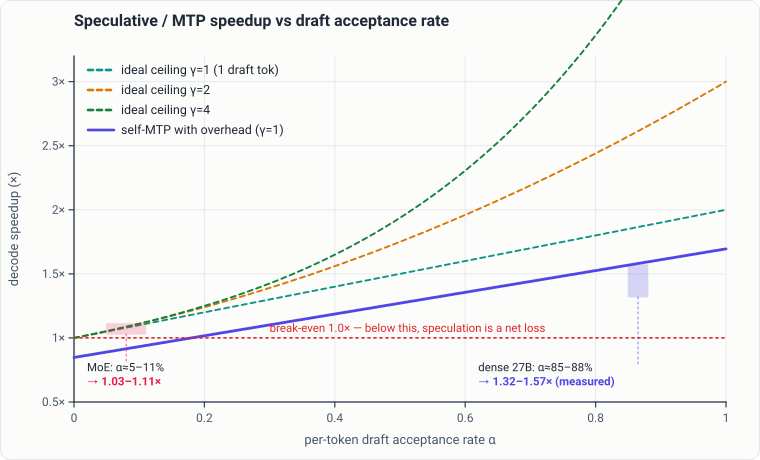
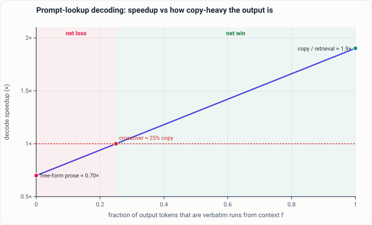

# Speculative decoding, MTP & prompt-lookup

Speculation is the most over-sold decode lever on Apple Silicon. On a CUDA
server the published multipliers (3–6×) are real; on a single-user Mac they
mostly are not. This chapter is about **when speculation pays and when it
quietly costs you throughput** — and how to tell the difference before you
spend a GPU window on it.

The one-sentence version: on a memory-bandwidth-bound Mac, plain speculation
tops out at roughly a **linear** speedup for a single stream, native
multi-token-prediction (MTP) self-spec is a modest and model-dependent win,
prompt-lookup pays big **only** on copy-heavy work, and a badly matched draft
model makes decoding *slower*. Every number below is measured on M5-class
hardware; verify against your own model and workload before trusting any of it
(see [measurement](measurement.md)).

---

## Why the roofline is linear for one user

Decode on Apple Silicon is bandwidth- and dispatch-bound, not compute-bound.
Apple's own base-M5-vs-M4 figures make the split concrete: prefill/TTFT is
**3.33×–4.06×** faster with the Neural Accelerators, but decode is only
**1.19×–1.27×** — "the first token is compute-bound and takes full advantage of
the Neural Accelerators; subsequent tokens are bounded by memory bandwidth."
Speculation is a decode-side trick, so it inherits the decode roofline, not the
prefill one.

The single-user ceiling was measured to its floor on a hybrid (Qwen3-Next-class)
model and it is a **hardware knee, not an exactness or memory-layout artifact**:

- The batched verify that any wide speculation needs runs `b×(depth+1)` tokens
  per weight read — 8 tokens at width 2. That pushes past the **N≈4 compute
  knee**, so the verify step costs ~1.9× a plain step, *exactly cancelling* the
  ~1.9× acceptance it buys.
- Linear self-MTP (batch 1, verify == commit, sitting **at** the knee) already
  extracts ~1.79 tokens per weight read — near the single-stream optimum.
- Profiling the direct-commit cycle: the fork/copy is only **4%** of cost, the
  batched verify is **80%**. Copy-on-write context sharing is therefore not the
  lever — perfect COW buys +4%.

!!! note "The headline throughput numbers are multi-user"
    Quoted "120/270 tok/s" style figures come from **N independent streams**
    amortizing the same past-knee weight read, one token each. A single stream
    cannot replicate that. Batching is the orthogonal axis to speculation: it
    attacks the same slack, and on a launch-bound target it dominates. The only
    thing that moves a *single* stream past ~1.5× is a **native multi-token
    head** trained to predict k tokens in-distribution — a training change, not
    a serving one.

> **Prior art.** Leviathan et al., *Fast Inference from Transformers via
> Speculative Decoding* (ICML 2023, arXiv:2211.17192), and Chen et al.,
> *Accelerating Large Language Model Decoding with Speculative Sampling*
> (arXiv:2302.01318), establish exact sampling through draft-and-verify.
> **How we differ.** Measured the roofline to its floor on M5-class hardware.
> **Our finding.** *Consistent with prior art* — single-user speculation tops out near linear; batching is the orthogonal multi-user axis.

There is a corollary method rule worth internalizing: **never infer per-row
verify cost from end-to-end spec-cycle deltas.** Bench bare forwards at widths
`1..k+1` first. On one launch-bound MoE, decode ran at only 40–56% of memory
bandwidth and a marginal verify row cost just **0.19–0.26×** a full forward —
so the loss in an EAGLE-style prototype there was ~6 ms/cycle of *engine*
overhead (draft-head forward, `lm_head`, logsumexp, per-draft syncs), not
physics. Attribute the cost to the right place or you will optimize the wrong
thing.

### Work the break-even point from timings

Acceptance rate alone does not tell you whether speculation wins. Measure the
cost of a plain target step, drafting, batched verification, and bookkeeping,
then divide the speculative cycle by the number of tokens it actually commits:

```python
def speculative_speedup(*, plain_step_ms, draft_ms, verify_ms,
                        overhead_ms, committed_tokens):
    if committed_tokens <= 0:
        raise ValueError("committed_tokens must be positive")
    spec_ms_per_token = (
        draft_ms + verify_ms + overhead_ms
    ) / committed_tokens
    return plain_step_ms / spec_ms_per_token

print(speculative_speedup(
    plain_step_ms=PLAIN_STEP_MS,
    draft_ms=DRAFT_MS,
    verify_ms=VERIFY_MS,
    overhead_ms=ROLLBACK_AND_SAMPLING_MS,
    committed_tokens=MEAN_COMMITTED_PER_ROUND,
))
```

Populate the inputs from distributions over complete rounds, not one lucky
prompt. `committed_tokens` includes only tokens made durable after rejection
sampling. Report its distribution alongside accept rate: two drafts can have
the same fraction accepted but different committed tokens per cycle because
their widths and rejection positions differ.

Use the result as a pre-gate. If the measured cycle is below break-even before
cache copies, sampling, and scheduling are fully included, the integrated
server will not rescue it. If it clears the gate, run the end-to-end benchmark
with exactness and state-rollback checks.

---

## Native MTP self-spec (no draft model)

Self-speculation uses the target model's own MTP head as the drafter and
verifies in one batched forward with exact rejection sampling — no second model
to load or keep resident. This is the technique behind mlx-lm **PR #990**
(`--mtp`, Qwen3.5/3.6). Measured behavior:

| target class | speedup | accept rate |
|---|---|---|
| dense 27B | **1.32×–1.57×** | 85–88% |
| MoE | **1.03×–1.11×** | 5–11% |



*A calculated model. The dashed ceilings are the overhead-free maximum for a
draft of length γ (pure math: `E[tokens/cycle] = (1−αᵍ⁺¹)/(1−α)`); the solid
line is a single-token self-MTP draft once per-cycle overhead is included, which
pulls a low-acceptance draft **below** break-even (1.0×) — a net loss. The
measured operating points land where you'd expect: dense models at high
acceptance win, MoE at ~5–11% acceptance barely clears break-even.*

Two things to take from this:

1. **A single MTP layer cannot predict sparse-expert routing.** With 256
   experts, one head guesses the routing for the next token about a tenth of
   the time — hence the 5–11% accept rate and near-zero MoE gain. Chained
   multi-token draft heads hit the same wall: a depth-1/2 EAGLE-style head on a
   128-expert MoE accepted only 14–30% per draft and ran at **0.37–0.61×** —
   a regression.
2. **The MTP gain shrinks as baseline decode gets faster.** The faster your
   plain step, the less headroom a draft/verify round has to recover its own
   overhead. On a cheap-per-token Mac target that overhead is proportionally
   large.

Operational note: `--mtp` sets `is_batchable=False`, so turning it on disables
continuous batching for that path — there is no dynamic switching between the
two. You are choosing self-spec **or** batching, not both, on that route.

**How to apply.** Start with deterministic greedy decoding and a fixed prompt
pack. Log proposed width, accepted prefix length, committed tokens, draft time,
verify time, and rollback count per round. Only after token identity matches
plain decode should you test sampling. Segment results by content type; a pooled
acceptance average can hide a route that loses badly on prose.

**When not to.** Do not enable MTP globally when the route already relies on
continuous batching, when the model's native head is absent, or when the model
has recurrent state you cannot checkpoint and replay. A feature flag that
silently changes scheduler behavior must be qualified as a service policy, not
just a decoder option.

The exception that ships is a **single-hidden corpus MTP head on a hybrid
model** (not pure MoE): 1.40× (strict k2) to 1.77× (relaxed k4) on the
worst-case workload. Hybrid attention layers give the head enough signal that
pure-MoE routing noise does not.

> **Prior art.** mlx-lm **PR #990** (native MTP self-spec, `--mtp`, Qwen3.5/3.6).
> **How we differ.** Measured MoE vs dense separately rather than as one number.
> **Our finding.** *Consistent with prior art* on dense (1.32×–1.57× @ 85–88% accept, matching the PR); *Extends prior art* on MoE — gains only ~1.03×–1.11× @ 5–11% accept because one MTP head can't predict 256-expert routing.

### Distrust unqualified vendor speedups

The MTPLX runtime advertises "**2.24× on M5 Max**." The mechanism is sound
(the same Leviathan/Chen rejection sampling everyone uses), but that figure is
**vendor-self-reported and contradicted by the author's own published table,
which shows ~1.05×.** Independent tests land at ~1.4× on M3 Max; realistic
expectation is **~1.4–1.6×**, not 2.24×.

> **Prior art.** The MTPLX project's self-reported "2.24× on M5 Max" figure.
> **How we differ.** Attempted reproduction and cross-checked the project's own table.
> **Our finding.** *Diverges from prior art* — 2.24× is vendor-self-reported and contradicted by the author's own ~1.05× table; realistic ~1.4–1.6×.

!!! warning "Rule of thumb for any speculation claim"
    A speedup number without a workload, an accept rate, a verify width, and a
    baseline you can reproduce is marketing, not measurement. Speculation
    figures move 40% across verify widths alone, and short-run figures amplify
    warmup noise (a 128-token benchmark read 1.74× where the same prompt at a
    trustworthy length read ~1.2×). Quote the band, not the peak.

---

## When a draft model makes you *slower*

External draft-model speculation is where teams most often lose throughput
without noticing. Two measured failure modes:

- **Draft too close to the target's active parameters.** A large MoE
  (Qwen3.5-397B-A17B) paired with a **9B draft** measured **−35%** (issue
  **#1132**). The killer is that **MoE verify loads the union of experts across
  all draft tokens** — a wide draft touches more distinct experts, and expert
  reads are the bandwidth cost. The draft has to be *much* cheaper than the
  target's active share, not just smaller than its total.
- **The M-series cheap-target wall.** On one served model, spec ran at
  **0.40×–0.44×** of plain decode with a 20B external draft, so speculation was
  **disabled there.** A re-measurement after the Neural-Accelerator MLX upgrade
  confirmed the old negative was not stale. A real EAGLE-3 prototype on MLX got
  **1.05× on M3 Ultra** (dense LLaMA-3.1-8B) and 0.94× with an fp16 draft —
  versus the paper's 3–6× on CUDA.

The empirical ceiling across a MoE/hybrid fleet: **speculative decoding does
not beat the simple baselines** (prompt-lookup for copy work + a single-hidden
MTP head for hybrids). Do not spend GPU time reproducing the paper
spec-decoding zoo unless a candidate demonstrably sidesteps *both* the MoE
routing ceiling and the cheap-target wall.

> **Prior art.** mlx-lm **issue #1132** (MoE spec-decode slowdown; verify loads the union of experts).
> **How we differ.** Measured the regime across MoE and a dense reasoning model.
> **Our finding.** *Consistent with prior art* — ~−35% in that regime and 0.40×–0.44× on a dense reasoning model, so we disabled spec there.

---

## The recurrent-state rollback trap (GDN / Qwen3-Next)

Speculation with recurrent / gated-delta-net (GDN) models has a correctness
hazard that has no analogue in pure-attention models. Rejected draft tokens
**advance and corrupt the recurrent state**, and a naive rollback trims the KV
but leaves the recurrent side desynced — the model then **skips tokens**. This
is the known upstream bug **#846** (Qwen3-Next-80B-A3B), fixed by **PR #1111**.

The fix is snapshot-before-verify + replay-accepted-on-rejection, and done
right it is **byte-identical to plain decode at ~1.15×**:

```text
# One speculative round against a recurrent (GDN) target.
snap = cache.checkpoint()          # capture KV *and* recurrent state
draft = mtp_head.draft(k)          # propose k tokens
logits = target.verify(draft)      # one batched forward, advances state
n = rejection_sample(draft, logits)  # accepted prefix length, 0..k

if n < len(draft):                 # a rejection happened
    cache.restore(snap)            # roll BOTH KV and recurrent state back
    cache.replay(draft[:n])        # re-advance only the accepted tokens
                                   #   plus the one bonus/corrected token
commit(draft[:n], bonus_token)
```

> **Prior art.** mlx-lm **issue #846** (spec skips tokens) + **PR #1111** (snapshot-before-verify + replay-accepted fix).
> **How we differ.** Implemented the checkpoint/replay rollback independently, working *before* #1111 landed.
> **Our finding.** *Consistent with prior art* — same mechanism, ahead of upstream in timing.

Two rules generalize from this:

1. **Any ephemeral intra-cycle cache state must be invalidated by *every*
   state-mutating operation** — `trim`/rollback, not only the cooperative
   cycle protocol. A separate live bug came from exactly this: a rollback
   cleared KV and the index-key ledger but left a shared-top-k skip flag armed,
   so attention advanced by one while the ledger did not, and a later step
   crashed on a broadcast-shape mismatch (or silently computed a wrong mask).
2. **Reusability checks must bind the full invariant, not a proxy.** An
   offset-based "is this cache reusable?" check could not see
   `len(index_keys) != offset` and reported reusable on a desynced cache. If a
   structure has a paired-ledger invariant, the reuse gate must check the pair.

---

## Prompt-lookup decoding (PLD)

PLD needs no draft model and no MTP head: it drafts by **retrieving n-grams
from the prompt/context itself**. That makes it the cleanest lever available —
and a strictly workload-dependent one.

| workload | PLD result |
|---|---|
| copy-heavy code edits | **2×–2.6×**, lossless |
| base-model copy continuation (105B-class, q6) | **2.72×** (123.1 vs 45.2 tok/s), lossless |
| retrieval / copy (35B-A3B) | **~1.87×** |
| free-form prose (same model) | **~0.70×** — a *loss* |

PLD wins exactly when the output overlaps the input (refactors, diffs,
extract-and-reformat, tool-call echoes) and loses on generative prose, where
there is nothing to look up and the draft/verify overhead is pure tax. It is a
**retrieval-only lever**: enable it for copy workloads, keep it off (or make it
adaptive/greedy-gated) for prose.



*A calculated model of PLD's workload dependence. Speedup rises with the copy
fraction and crosses break-even (1.0×) at roughly a quarter of the output being
copyable: below that it is a net loss, above it a growing win — matching the
measured ~0.70× on prose and ~1.9× on retrieval/copy. The lesson is that PLD's
sign, not just its magnitude, depends on the workload.*

> **Prior art.** The general prompt-lookup-decoding technique (n-gram copy from context).
> **How we differ.** Measured across workload types rather than a single benchmark.
> **Our finding.** *Consistent with prior art* but sharpened — big win on retrieval/copy (~1.87×+), net loss on free-form prose (~0.70×); a workload-dependent, retrieval-only lever.

The verify-span operating point is **target-specific**, too. A tiny model
jumped 2.06× in per-token cost from verify length 8 to 9; a mid-size MoE moved
only 1.07× and a small-active-share production checkpoint 1.03×, both scaling
smoothly. Do not port one model's cliff-aware span band into another model's
defaults — measure the whole verify curve per target and only enable
cliff-aware routing when that target shows a penalty band.

### A safe adaptive policy

PLD can be routed from observable workload evidence without guessing the user's
intent. Enable a trial window only when the prompt contains repeated spans long
enough to draft from, then keep it on while committed tokens per cycle beat the
plain baseline:

```text
if prompt_has_reusable_ngrams:
    run_one_warmed_pld_cycle()
    while committed_tokens / cycle_time > plain_tokens_per_second:
        run_pld_cycle()
else:
    run_plain_decode()
```

Arm the rate window after the first warmed cycle, especially on a prefix-cache
hit. Use hysteresis before switching modes so one rejection does not make the
decoder thrash. The controller must preserve the exact sampler and cache state
across the switch; speed policy is not permission to change output semantics.

---

## The "spec decays with output length" myth

A widely repeated claim is that speculation "decays with output length" — e.g.
1.74× at 128 tokens collapsing to ~1.2× from 512 on. That specific curve was
**real but came from a single prompt**, and the general law was **refuted** by
a 36-prompt × 3-content-strata decomposition:

- There is a **universal first-tranche warmup drop** shared by all content
  (the aggregate effect that *looked* like length decay).
- Within-stream decay after warmup is **content-specific — prose only.** Pooled
  slope CI includes zero; only prose has a significant negative slope. Code and
  tool-JSON acceptance are **flat or U-shaped** (they recover at long horizon).
- The persistent effect is a **content main effect**: tool_json ≫ code ≈ prose
  at every horizon (accept rate prose 0.52→0.41, code ~0.60–0.62, tool_json
  0.82→0.72). Prose sits at or below the break-even of ~2.0 accepted/round from
  roughly horizon 96 onward; code and structured output stay 2.2–4.3 throughout.

The corrected finding matters operationally: a **length-based** throttle is
wrong (it would kneecap code edits that still earn 1.6× at 2048 tokens). The
right control is **content-aware, or acceptance-aware** — keep speculating while
measured tokens-per-cycle beats plain decode, back off when it does not, at any
length.

> **Prior art.** An informal claim that speculation decays with output length.
> **How we differ.** Decomposed it across 36 prompts × 3 content strata.
> **Our finding.** *Diverges from prior art* — length is not the mechanism; the effect is content/accept-rate driven, not length per se.

---

## "Spec park is insurance, not gain"

A park/resume controller — one that stops speculating when predicted
tokens-per-cycle drops below plain decode — is worth building, but be honest
about what it buys. When measured against real workloads, a well-calibrated
controller **would not fire** on any of them: every workload measured was
net-positive for speculation (1.20×–1.61×), and 1.20× is a *win*, not a defect.

So a park path is **insurance against pathological collapse** (which does happen
in the field — other runtimes have shipped controllers that park a whole model
when acceptance craters), not a throughput gain on healthy traffic. If
speculation always wins on your traffic, the higher-value lever is **raising
acceptance** (a sharper draft sampler, a better head), not gating it. And the
meta-rule: **a spec path that would not fire on your real workload buys nothing
— measure on *your* workload, not the benchmark's.**

---

## Where the remaining single-user headroom is

Given the linear roofline, the honest levers for one user are narrow:

- **A native multi-token MTP head** trained to predict k tokens
  in-distribution, so one batch-1 verify commits k tokens per read without
  crossing the compute knee. This is a training investment. A cheaper
  proposal-only **compact draft head** (row-selected vocabulary, greedy
  self-MTP) was built and bounds its own upside at **~3.4–5.6% per k=2 cycle**
  before a real GPU gate — useful, small, and honest about being small.
- **Batching**, including **quantized-KV batched self-MTP**, which halves or
  quarters the context-proportional cache so more lanes fit at long context.
  This is the *multi-user* lever; it does nothing for a single stream.

Both confirm the same shape: single-user speculation is a linear-ish,
low-single-digits-to-~1.5× lever, and the big multipliers live in batching and
in training-time head changes — not in a cleverer serving loop.

---

## Practical checklist

- **Copy/refactor/tool-echo workload?** Enable PLD. Expect ~1.9×–2.7×,
  lossless. Keep it off for prose (it loses, ~0.70×).
- **Dense model, want a serving-only win?** Try native MTP self-spec
  (`--mtp`). Expect ~1.3×–1.6× — and remember it disables batching on that
  route.
- **Pure MoE?** Self-spec buys almost nothing (~1.03×–1.11×); an external draft
  can go *negative*. Don't bother unless a candidate beats a single-hidden head
  in a capacity-controlled pre-gate.
- **Recurrent / GDN model?** You *must* snapshot-and-replay the recurrent state
  on rejection, or you will silently skip tokens. Verify byte-identity against
  plain decode.
- **Any external draft?** The draft must be far cheaper than the target's
  *active* params, not just its total. MoE verify pays for the union of experts
  across draft tokens.
- **Always** benchmark bare forwards at widths `1..k+1`, quote the workload and
  accept rate with every speedup, and measure on your own traffic before
  trusting a vendor multiplier.

!!! note "Transfer to llama.cpp and vLLM-on-Metal"
    Draft-and-verify arithmetic is backend-independent. In `llama.cpp`, measure
    the draft and target models' *active bytes* and the cost of moving between
    their contexts. In a vLLM-style Metal server, compare speculation with
    continuous batching at the same offered load; an idle single-stream win can
    disappear once the scheduler already supplies width. PLD needs only token
    history and a verifier, so it transfers most directly, but it remains a
    copy-workload lever rather than a general decoder default.

See also: [the hardware model](hardware.md) for the bandwidth/dispatch roofline
that sets the decode ceiling, [measurement](measurement.md) for the benchmark
hygiene these numbers depend on, and [serving techniques](serving-techniques.md)
for batching and KV-cache levers that compose with (and usually beat)
single-user speculation.

---

## Sources

Public references, as cited in the primary M5-serving audit:

- Leviathan et al., *Fast Inference from Transformers via Speculative
  Decoding* — ICML 2023, arXiv:2211.17192.
- Chen et al., *Accelerating Large Language Model Decoding with Speculative
  Sampling* — arXiv:2302.01318.
- vLLM documentation — speculative decoding and serving-level scheduler
  interactions: <https://docs.vllm.ai/>

- mlx-lm **PR #990** — native MTP self-spec (`--mtp`), Qwen3.5/3.6, no draft
  model.
- mlx-lm **issue #846** + **PR #1111** — Qwen3-Next spec-decode token-skip bug
  (recurrent GDN state corruption) and the snapshot/replay fix.
- mlx-lm **issue #1132** — MoE + close-to-target draft speculative slowdown.
- **MTPLX** (`github.com/youssofal/MTPLX`) — MTP self-spec runtime; mechanism
  sound, but its M5-speedup figures are **unverified/vendor-self-reported** and
  contradicted by the author's own table.
- Apple ML Research, *Exploring LLMs with MLX and the Neural Accelerators in the
  M5 GPU* — the prefill-vs-decode uplift split (TTFT 3.33×–4.06×, decode
  1.19×–1.27×).
